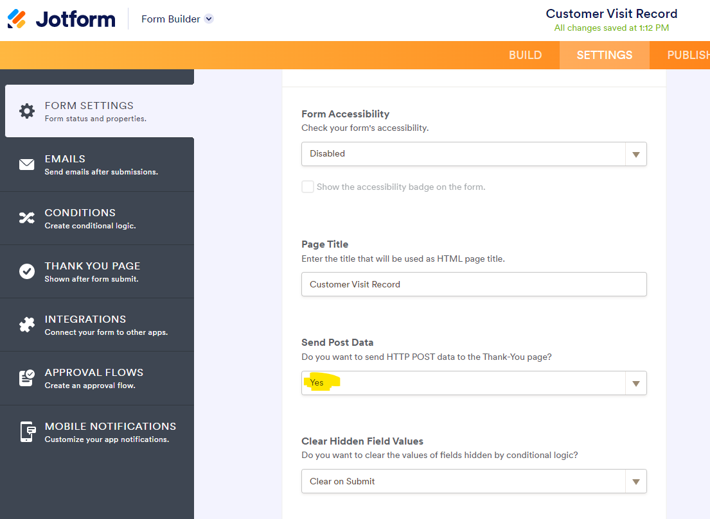
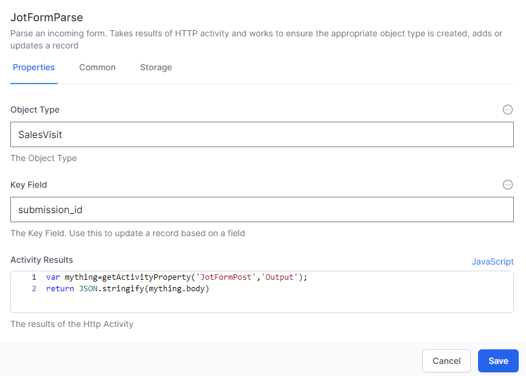

# JotForm Integration

[Jotform](https://jotform.com) is a popular electronic forms application. HubOne Workflows integrates with Jotforms configured in a specific way.

To start, build a form in Jotform.

## To configure a jotform to work with HubOne Workflows

1. In HubOne Workflows, create a new Workflow
2. Add a **HTTP Endpoint** activity configured as follows:
   
   
   Set the Path to be any path you want, but ensure POST and Read Content are both checked. Ensure you go to **Common** and set the **Technical Name** to be **JotFormPost**.
3. [Optional] Add a HTTP Response Activity after this to show some feedback to the user. You could even add a [Thank you page](thank-you-page.md).
4. Go to Jotform and open your form
5. Click **SETTINGS**
6. Choose **Form Settings**
7. Click **Show More Options** to see more options
   
8. Scroll down until you see **Send Post Data**. Ensure this is set to **Yes**
   
9.  Still in Jotform, click **THANK YOU PAGE**
10. Select **Redirect to an external link after submission**
11. Enter the URL of your workflows instance followed by the **Path** from the Activity you created in step 1

    > Congratulations, you now have a jotform sending data to Workflows. There is lots you can do with this data, but one of the key things is to get it into the workflows database for later processing.

    Workflows comes with a special Activity, **Jotform Parse** which takes information from Jotform and will insert or update the workflows database as needed.

12. To make this work, go back to the workflow you created in step 1, above.
13. At the end of the workflow, add the **Jotform Parse Activity**

    

    Enter the information as follows:

    | Item | Contents | Reason |
    | --- | --- |--- |
    | Object Type | SalesVisit | This is the name of the object type you want to append to. if this is not in your database, the activity will automatically add it |
    | Key Field | submission_id | This is the key field, you can ensure the platform updates any objects with this field matching the one from jotform. For example, setting this to submission_id ensures that repeat identical submissions only update the data |
    | Activity Results | see below | This inserts the body from the HTTP Activity |

    The Activity results script is shown below:

    ```js
    var mything=getActivityProperty('JotFormPost','Output');
    return JSON.stringify(mything.body)
    ```

    > Remember, change the text ```JotFormPost``` in the script to match the tehcnical name of the activitt created in Step 1, above.

_last updated 3 Oct 2022 - nickbeau_
